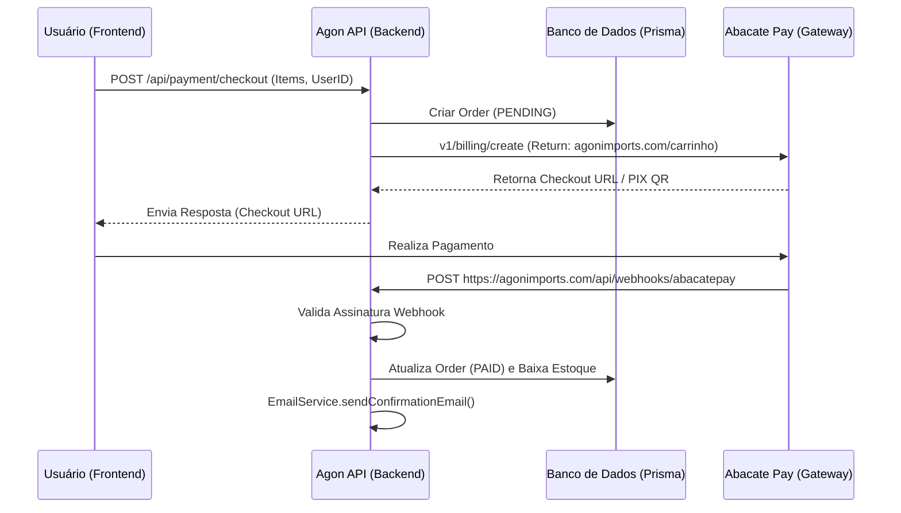

# Workflows — Agon Logic Flows

Nesta seção detalhamos os fluxos de trabalho fundamentais que regem a lógica de negócios do Agon.

## 1. Fluxo de Compra e Pagamento (Abacate Pay)

Este é o fluxo crítico do e-commerce, garantindo integridade financeira e de estoque.

## 2. Cadastro e Login Inteligente (Agon Auth)

- A interface é unificada em `/login`.
- **Registro**: Cria `User`, envia `Email de Boas-vindas` e gera o primeiro `JWT`.
- **Identificação Automática**: Reutiliza dados preexistentes no LocalStorage para acelerar o processo.

## 3. Fluxo de Recuperação de Senha (OTP)

1. Usuário solicita em `/forgot-password`.
2. API gera `VerificationToken` (6 dígitos) com validade de 15 minutos.
3. `EmailService` envia o OTP via Resend.
4. Usuário valida o código e redefine a senha.
5. Login automático imediato após sucesso.

## 4. Gestão de Favoritos (Wishlist Sync)

- Itens salvos como visitante são sugeridos para vinculação ao login.
- Limite de 20 itens por usuário.

## 5. Fulfillment de Pedidos (Admin)

- Administrador acessa `/admin/orders`.
- Insere o `Código de Rastreio`.
- Backend atualiza status `PAID` → `SHIPPED` e notifica o cliente via e-mail.

## 6. 🔒 Governança de Workflows

### 🔒 Regras Obrigatórias
- **Order State Integrity**: O status de um pedido só pode ser alterado por eventos validados (Webhook ou Admin Autenticado).
- **Atomic Operations**: Garanta que a criação de um pedido e o abatimento de estoque ocorram de forma atômica (Prisma Transactions).
- **Session Continuity**: Dados de carrinho devem persistir mesmo após o login (Merge de Carrinho).

### 🚫 Anti-padrões
- **Floating Orders**: Pedidos criados no banco sem um `abacateBillingId` correspondente iniciado.
- **Silent Failures**: Falhar no envio de e-mail de confirmação sem registrar o erro para auditoria administrativa.

### ✅ Boas Práticas
- **Optimistic UI**: Atualize a interface localmente antes de receber a confirmação total do servidor em ações simples (Ex: Wishlist).
- **Clear Transitions**: Use `OrderStatus` de forma linear e lógica para facilitar o rastreio pelo cliente.

## 7. Workflow de Pull Requests
Trabalhamos sob um conceito rigoroso do modelo Github Flow com travas pesadas. Tudo precisa transacionar em Pull Requests em virtude das automações.
- **Merge Block**: Está configurado nativamente que é proibido empurrar código sujo (`push`) para main. Requisições sofrem `Check Review` das *Github Actions* e só procedem se tudo estiver iluminado em verde.
